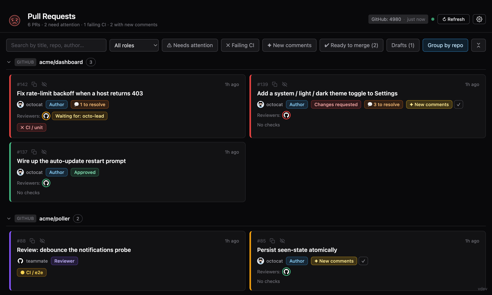

# PR Dashboard

A **desktop app** (Electron) for tracking pull requests across **GitHub** and
**GitHub Enterprise** in one place. It shows an always-current list of PRs where
you're involved (author or requested reviewer) and highlights what needs
attention:

- ✗ **failing CI** — individual named checks (unit tests, Sonar, etc.) are shown by name;
- ✦ **new comments** — comments added since the last time you viewed the PR;
- 💬 **unresolved comments** — how many threads still need to be resolved;
- review state (approved / changes requested / review required), drafts, author, last update.



Cards can be grouped by repository, by issue, or by **parent Jira task** (see
[Jira](#jira-optional--parent-task-grouping) below), and are colour-coded down the
left edge (red = needs attention, green = ready to merge, yellow = CI running,
purple = your review is requested). One-click **filters** (needs attention, failing CI, new comments,
ready to merge, drafts) and a search box narrow the list; a **status buddy** in
the header reflects the overall mood at a glance, and any PR you don't care about
can be **ignored** and tucked behind an "Ignored" filter. Light / dark / system
**theme** follows the OS or can be pinned in Settings.

It is **per-user and single-identity**: tokens are read from the
[`gh` CLI](https://cli.github.com/) you're already signed into — there is no
OAuth flow and **nothing is stored** by the app. Settings (hosts, repos, refresh
interval, theme) live in the OS user-data directory, never in the repo.

## Tech stack

Electron · Vite + React 19 + Tailwind CSS v4 (renderer) · TypeScript · Node
(main) · GitHub GraphQL API · `electron-updater` for auto-update.

## How it works

- The **main process** runs a single poller that queries every configured host
  (one GraphQL request per host — `author:@me` + `review-requested:@me` +
  team-review requests, merged via aliases; ~1–8 rate-limit points). It backs
  off automatically as a host's rate limit runs low.
- The **renderer** (the dashboard UI) talks to main only through a typed
  `window.api` bridge (`contextIsolation` on, `nodeIntegration` off). It gets the
  initial snapshot via `invoke`, then live updates pushed on every real change —
  no client-side polling.
- **Tokens** are resolved per host from `gh auth token --hostname <host>` at
  fetch time. The host is derived from the GraphQL URL, so the same logic covers
  github.com, Enterprise Cloud (`*.ghe.com`) and Enterprise Server.
- The **"seen" state** (for new-comment detection) is stored in the user-data
  directory, so it survives restarts.

## Prerequisites

1. Install the GitHub CLI: <https://cli.github.com/>
2. Sign in to each host you want to watch:

   ```bash
   gh auth login --hostname github.com
   gh auth login --hostname your-tenant.ghe.com
   ```

   The token needs the **`repo` scope** (for private repositories).

## Jira (optional — parent-task grouping)

The **Group by parent task** view clusters your review PRs under the Jira issue
they belong to (e.g. subtasks `ENG-1234`, `ENG-1235` sit under their parent task).
To enable it:

1. Create a **read-only API token** at
   [id.atlassian.com](https://id.atlassian.com/manage-profile/security/api-tokens).
   A scoped token with just the **`read:jira-work`** scope is enough; a classic
   (unscoped) token also works. (Scoped tokens are routed through the
   `api.atlassian.com` gateway automatically; classic tokens use the site URL.)
2. Open **Settings → Jira** and enter the **Site URL**
   (`https://your-org.atlassian.net`), your **account email**, and the token.

The token is encrypted by your OS keychain and kept out of `settings.json`. Issue
keys are parsed from PR titles/branches; if grouping stays empty the dashboard
shows why (the token can't read the issues, or the PRs aren't subtasks).

## Develop

```bash
npm install
npm run dev      # Vite dev server (HMR) + Electron
```

To work on the UI without `gh` or the network, use the fixture mode: set
`PRD_MOCK=1` (canned PRs in Electron — cases live in `src/main/mock.ts`, switched
live via a `.prd-mock` file), or run the renderer alone in a browser and let
`dev-mock.ts` stub `window.api` (`?buddy=sad|curious|sleeping|showcase` picks a
fixture set). The screenshot above is the `showcase` set.

On first launch the dashboard is empty — open **Settings (⚙)** and add a host:

| Field        | Description |
| ------------ | ----------- |
| `label`      | Name shown in the UI (host badge + host filter). |
| `graphqlUrl` | github.com → `https://api.github.com/graphql`; Enterprise Cloud → `https://api.<tenant>.ghe.com/graphql`; Enterprise Server → `https://<host>/api/graphql`. |
| repos        | Repositories in `owner/name` form, one per line. |

The Settings screen also shows whether `gh` is installed and signed in for each
host, with the exact `gh auth login` command if not.

## Build & package

```bash
npm run typecheck    # tsc, both projects
npm test             # unit tests for the config/host logic
npm run build        # tsc (main) + vite (renderer) -> dist/
npm run package      # electron-builder: .dmg (mac) / .exe (win)
npm run package:dir  # unpacked app dir (fast, unsigned) for a quick check
```

## Releases & auto-update

Updates are delivered via **GitHub Releases** (public repo, so clients update
without a token). `electron-updater` checks on launch and every few hours, and
prompts **Restart now / Later** once an update is downloaded.

Both release scripts only **build** with electron-builder (`--publish never`,
which still emits the `latest*.yml` update feeds) and then upload artifacts to a
single release **by its ID**, resolved from the `/releases` list (which matches
draft releases). This is what keeps the macOS and Windows artifacts on the *same*
release with no duplicate drafts — don't pass `--publish` to electron-builder for
releases.

To cut a release:

1. Bump `version` in `package.json`, sync the lockfile
   (`npm install --package-lock-only`), commit, then tag and push `vX.Y.Z`.
2. **macOS** — on a Mac with a Developer ID Application certificate:

   ```bash
   UPLOAD_RELEASE=1 GH_TOKEN=<token with repo scope> \
   MAC_CERT_P12=~/secrets/Certificates-1.p12 MAC_CERT_PASSWORD=... \
   APPLE_API_KEY=~/secrets/AuthKey_XXXX.p8 \
   APPLE_API_KEY_ID=XXXX APPLE_API_ISSUER=<uuid> \
   npm run release:mac
   ```

   Builds, signs, notarizes, and uploads the `.dmg` + `.zip` + `latest-mac.yml`
   to a **draft** `vX.Y.Z` release (creating it if it doesn't exist yet).
3. **Windows** — on a Windows host (e.g. ts1-core-dev04) over SSH:

   ```powershell
   powershell -ExecutionPolicy Bypass -File scripts\release-win.ps1 -Token <gh-token>
   ```

   Builds the NSIS installer and uploads the `.exe` + `latest.yml` to the same
   `vX.Y.Z` release. (Or use the **Release** GitHub Action for the Windows half.)
4. Review, then publish: `gh release edit vX.Y.Z --draft=false --latest`. Existing
   installs pick it up automatically.

> Steps 2 and 3 may run in any order. To run them in **parallel**, pre-create the
> release once first — **with real notes**, e.g.
> `gh release create vX.Y.Z --draft --title vX.Y.Z --generate-notes` (auto-changelog
> from commits/PRs since the last tag), or `--notes-file <file>` for hand-written
> notes. Never pass `--notes ""` — an empty draft stays empty unless someone
> remembers to edit it before publishing.

> First-time setup the maintainer does once: create the App Store Connect API key
> (Issuer ID + Key ID + `.p8`) and export the Developer ID Application `.p12`.
> Windows builds are **unsigned** for now (SmartScreen will warn on first run).

## Structure

```
src/
  main/                 # Node / Electron main process
    main.ts             # window, lifecycle, IPC registration, CSP, updater wiring
    preload.ts          # contextBridge -> window.api (typed)
    poller.ts           # single poller -> webContents.send("snapshot"/"config-error")
    settings.ts         # read/write userData/settings.json
    ipc-validation.ts   # validate renderer-supplied IPC arguments
    updater.ts          # electron-updater (check / download / restart)
    cli-path.ts         # locate the gh binary across install layouts
    mock.ts             # PRD_MOCK fixture mode (dev-only, no network)
  shared/               # Node domain logic (renderer imports types only)
    github.ts           # GraphQL query + mapping
    state.ts            # seen-state (new-comment baseline)
    ignored.ts          # per-PR ignore state
    notifications.ts    # cheap notifications probe (poll cadence hint)
    config.ts           # gh token resolution + settings validation + gh status
    types.ts            # domain types + the window.api contract
  renderer/             # Vite + React + Tailwind v4
    index.html
    src/
      App.tsx           # dashboard + settings routing
      components/        # PrCard, CheckBadge, Buddy, Settings
      dev-mock.ts       # browser-only window.api stub for renderer-alone dev
      format.ts         # client-side formatting helpers
build/                  # icon.png + mac entitlements (electron-builder resources)
scripts/                # dev launcher, mac release, icon generator
```

## Notes

- One request per host per refresh; multiple `repo:` qualifiers act as OR.
- Checks are deduplicated by name; on re-runs, the worst state wins.
- The first time a PR appears its state is recorded as a baseline, so you don't
  get a "forest" of NEW badges on first run.
- "New comments" is based on the comment count, not on `updatedAt` — pushing
  your own commit or changing labels does not flag a PR.
